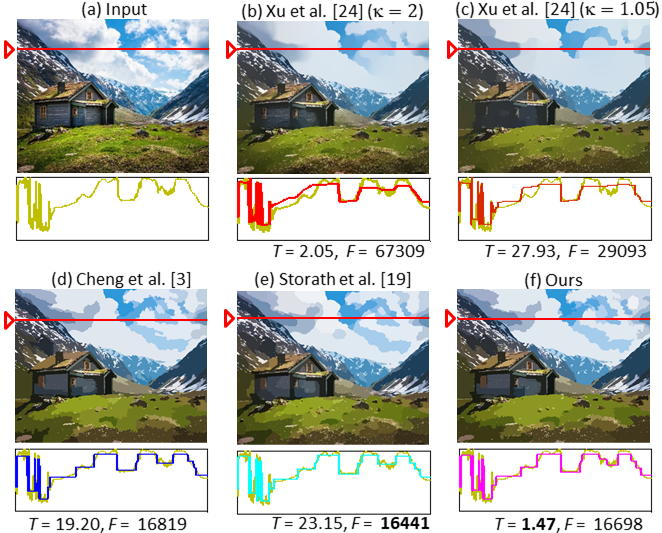

# Fast and Effective L0 Gradient Minimization by Region Fusion

This paper has been accpeted by [International Conference on Computer Vision 2015](http://pamitc.org/iccv15/).

[Fast and Effective L0 Gradient Minimization by Region Fusion](https://www.cv-foundation.org/openaccess/content_iccv_2015/papers/Nguyen_Fast_and_Effective_ICCV_2015_paper.pdf)

by Rang Nguyen, and Michael Brown. 


### Citation
```
@inproceedings{nguyen2015fast,
  title={Fast and effective L0 gradient minimization by region fusion},
  author={Nguyen, Rang MH and Brown, Michael S},
  booktitle={Proceedings of the IEEE international conference on computer vision},
  pages={208--216},
  year={2015}
}
```


## Contents

- [Introduction](#introduction)
- [Usage](#usage)
- [Results](#results)
- [Contacts](#contacts)

## Introduction
L0 gradient minimization can be applied to an input signal to control the number of non-zero gradients. This is useful in reducing small gradients generally associated with signal noise, while preserving important signal features. In computer vision, L0 gradient minimization has found applications in image denoising, 3D mesh denoising, and image enhancement. Minimizing the L0 norm, however, is an NP-hard problem because of its non-convex property. As a result, existing methods rely on approximation strategies to perform the minimization. In this paper, we present a new method to perform L0 gradient minimization that is fast and effective. Our method uses a descent approach based on region fusion that converges faster than other methods while providing a better approximation of the optimal L0 norm. In addition, our method can be applied to both 2D images and 3D mesh topologies. The effectiveness of our approach
is demonstrated on a number of examples.

## Usage

### 1. Image
INTRODUCTION (IMAGE L0)
------------
The folder contains two things as follows:
 * exe: contains the executable file for Windows OS (including Win32 and x64).
 * src: contains our source code implemented in C++. 

HOW TO RUN
------------
Usage is -i <infile> -t <lambda> -o <outfile>[Optional]
Example: type as follows in command line 
l0_norm.exe -i country_house.jpg -t 0.2 -o country_house_l0.png

NOTE: can open source code using Visual Studio 2010


### 2. 3D Mesh
INTRODUCTION (MESH DENOISE)
------------
The folder contains two things as follows:
 * exe: contains the executable file for Windows OS (including Win32 only).
 * src: contains our source code implemented in C++. 

HOW TO RUN
------------
Usage is -i <infile> -t <lambda> -o <outfile>
Example: type as follows in command line 
Mesh_Denoising.exe -i pyramid_noise.ply -t 0.5 -o pyramid_denoise.ply

NOTE: can open source code using Visual Studio 2010

#### Dependencies
- C++


## Results


## Contact
If you have any question, please feel free to email me.

Rang Nguyen (rangnhm@gmail.com)
